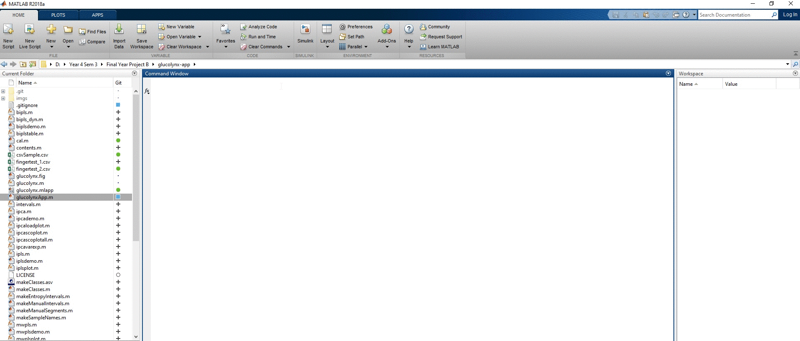

 
 
 

# Glucolynx-App

Glucolynx app is a simple blood glucose monitoring application by using Near-Infrared Spectroscopy (NIRS). Machine Learning algorithms in MATLAB are used to predict blood glucose level.
NIR data are generated as *.csv* files by **DLP® NIRscan™ Nano Evaluation Module** from **Texas Instruments** from scanning fingertips. By default, this code will extract the absorbance data from .csv file.  

## Getting Started

MATLAB *(above R2016a)* must be installed on local machine.

### Installation

If you want to run the latest code from git, here's how to get started:

1. Clone the code:

        git clone https://github.com/theinhtut/glucolynx.git
        cd glucolynx

2. Open MATLAB and run

        run('glucolynxApp.m');

## Built With

* [MATLAB R2018a](https://www.mathworks.com/) - Multi-paradigm numerical computing environment and proprietary programming language developed by MathWorks.
* [MATLAB App Designer](https://www.mathworks.com/products/matlab/app-designer.html) - A rich development environment that provides layout and code views, a fully integrated version of the MATLAB® editor.

## Version
Glucolynx-App v1.0.0

## Authors
* **Thein Htut** - *Glucolynx-App* - [Github](https://github.com/theinhtut)
* **Lars Nørgaard** - *iPLS Toolbox for MATLAB* - lno@foss.dk
FOSS Affiliated professor in Chemometrics Group,
Quality & Technology University of Copenhagen Denmark

* **Riccardo Leardi**, - *iPLS Toolbox for MATLAB: bipls & bipls_dyn* -  riclea@dictfa.unige.it
Department of Pharmaceutical and Food Chemistry and Technology University of Genoa Italy

See also the list of [contributors](https://github.com/theinhtut/glucolynx/graphs/contributors) who participated in this project.

## References
L. Nørgaard, A. Saudland, J. Wagner, J.P. Nielsen, L. Munck and S.B. Engelsen, Interval Partial Least Squares Regression (iPLS): A Comparative Chemometric Study with an Example from Near-Infrared Spectroscopy, Applied Spectroscopy, 54, 413-419, 2000.

R. Leardi and L. Nørgaard, Sequential application of backward interval-PLS and Genetic Algorithms for the selection of relevant spectral regions, Journal of Chemometrics, 18, 486-497, 2004.

## License
This project is licensed under the MIT License - see the [LICENSE](LICENSE) file for details

## Acknowledgments
* Brillianda Sheravina - For awesome logo design ideas, application name and inspiration by love ❤
* Lars Nørgaard & Riccardo Leardi - Awesome iPLS Toolbox for MATLAB
* To anyone whose codes were used as reference.
